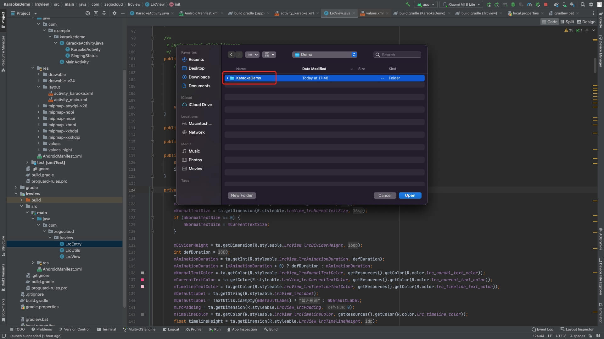
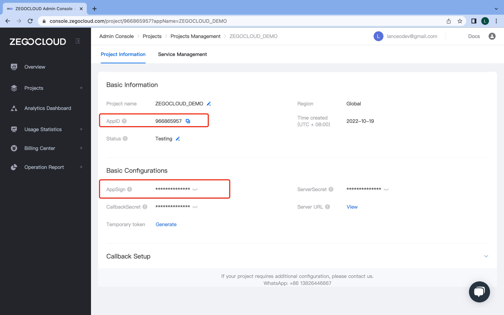
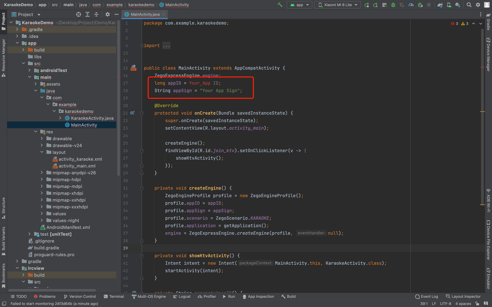
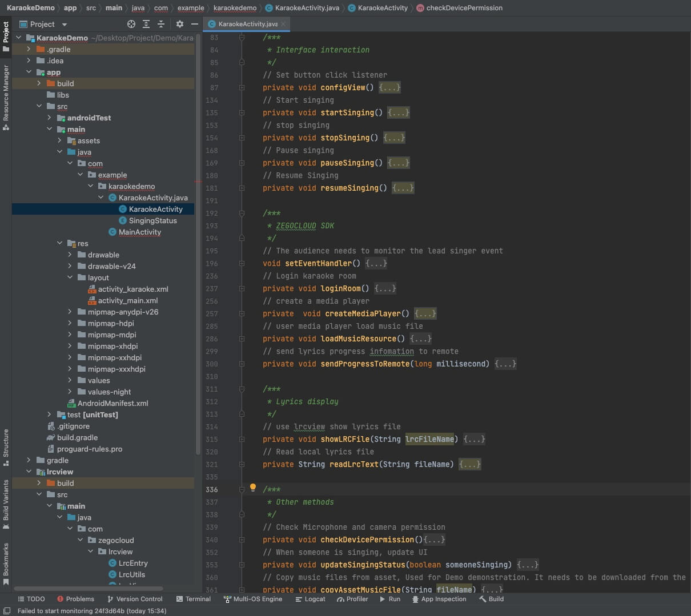
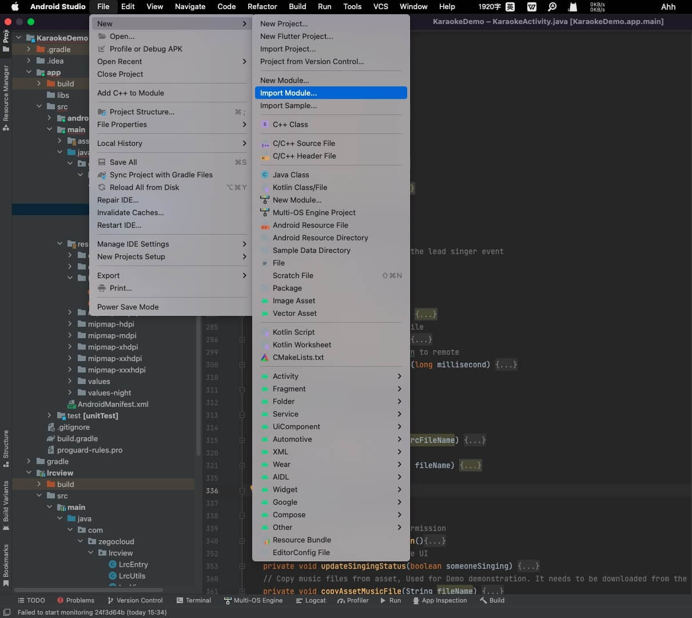

# README

## How to run demo

### 1. Run a demo

<iframe width="560" height="315" src="https://www.youtube.com/embed/3JTpQncgbNQ" title="YouTube video player" frameborder="0" allow="accelerometer; autoplay; clipboard-write; encrypted-media; gyroscope; picture-in-picture" allowfullscreen></iframe>

### 2. Download the demo file
If you want to learn how to implement the Karaoke project, you can download this Demo for reference.

### 3. Open the project with Android Studio
Open Android Studio, click `File -> Open`, and select the downloaded file.



### 4. Change authentication information
Log in to the [ZEGOCLOUD console](https://console.zegocloud.com), create a new project, and after the creation is successful, you can get the authentication information `AppID` and `AppSign`.



Open the `MainActivity` file and fill in the `AppID` and `AppSign` authentication information. After the modification is complete, the project can be run.




## How to use demo source code

### 1. Project structure
The project is divided into two modules `app` and `lrcview`,
- `app` is the code logic of karaoke Demo, you need to refer to the code logic of this module when implementing karaoke functions.
- `lrcview` is the lyrics component, in your project, you need to import this directory into your project. Section 3 will introduce how to import it.
```
.
├── app                             ---- Demo resources
│   ├── src/main/java/com/example/karaokedemo       
│       ├── MainActivity            ---- Demo launch page 
│       ├── KaraokeActivity         ---- Karaoke main page
│   ├── res/layout
│       ├── activity_main.xml       ---- Demo launch page layout
│       ├── activity_karaoke.xml    ---- Karaoke main page layout
├── lrcview                         ---- Lyric component
│   ├── src/main/java/com/zegocloud/lrcview
│       ├── LrcView                 ---- Lyrics view
│       ├── LrcUtils                ---- Lyric format processing
│       ├── LrcEntry                ---- Lyrics per line
```

The main logic implemented by Karaoke is implemented in `KaraokeActivity`, which is divided into four parts:
- Life cycle.
- Interface interaction.
- ZEGOCLOUD SDK.
- Lyrics display.
- Other methods.

Among them, `Interface interaction`,`ZEGOCLOUD SDK` and `Lyrics display` are the core logic you need to refer to. Other modules are logic added for demonstration purposes. Your project can decide whether a reference is needed based on business needs.

```
.
├── Life cycle
│   ├── onCreate()              ---- Demo launch page       
│   ├── onDestroy()             ---- Demo launch page 
├── Interface interaction
│   ├── configView()            ---- Set button click listener   
│   ├── startSinging()          ---- Start singing
│   ├── stopSinging()           ---- stop singing
│   ├── pauseSinging()          ---- Pause singing
│   ├── resumeSinging()         ---- Resume Singing
├── ZEGOCLOUD SDK
│   ├── setEventHandler()       ---- Listen for SDK callback events
│   ├── loginRoom()             ---- Login karaoke room
│   ├── createMediaPlayer()     ---- Create an music player
│   ├── loadMusicResource()     ---- load music files
│   ├── sendProgressToRemote()  ---- send lyrics progress to remote
├── Lyrics display
│   ├── showLRCFile()           ---- Show lyrics
│   ├── readLrcText()           ---- Read lyrics file
├── Other methods
│   ├── checkDevicePermission() ---- Apply for camera and microphone permissions
│   ├── updateSingingStatus()   ---- Update current singing status
│   ├── copyAssetMusicFile()    ---- Copy music files from asset
│   ├── copyAssetToFile()       ---- Copy files from Asset

```


### 2. Import ZEGOCLOUD SDK

Refer to [Access Documentation](https://docs.zegocloud.com/article/7942) to import ZEGOCLOUD SDK.

### 3. Import Lyrics component

Click File -> New -> Import Module. Then select the `lrcview` folder in Demo.



### 5. Method Description

After the SDK is imported, you need to refer to the Demo and call the following methods in sequence.

#### 5.1 Add Lyrics View
Refer to `activity_karaoke.xml` file, add `lrcview`, to your karaoke interface.
```xml
<com.zegocloud.lrcview.LrcView
        android:id="@+id/lrc_view"
        android:layout_width="match_parent"
        android:layout_height="0dp"
        app:lrcAnimationDuration="1000"
        app:lrcCurrentTextColor="#3F51B5"
        app:lrcDividerHeight="20dp"
        app:lrcNormalTextColor="#BDBDBD"
        app:lrcNormalTextSize="15sp"
        app:lrcPadding="16dp"
        app:lrcTextGravity="center"
        app:lrcTextSize="15sp"
        app:lrcTimeTextColor="#BDBDBD"
        app:lrcTimelineColor="#80BDBDBD"
        app:layout_constraintTop_toTopOf="parent"
        app:layout_constraintBottom_toBottomOf="parent"
        android:layout_marginBottom="200dp"
        android:layout_marginTop="100dp"
        app:lrcTimelineTextColor="#9FA8DA" />
```

#### 5.2 Create ZEGOCLOUD engine
Before using the SDK functions, the SDK needs to be initialized first. You can refer to the `createEngine` method in the `MainActivity` file.

```java
private void createEngine() {
    ZegoEngineProfile profile = new ZegoEngineProfile();
    profile.appID = appID;
    profile.appSign = appSign;
    profile.scenario = ZegoScenario.KARAOKE;
    profile.application = getApplication();
    engine = ZegoExpressEngine.createEngine(profile, null);
}
```

#### 5.3 Set SDK callbacks
Before joining a karaoke room, you need to listen to SDK callback events to avoid information loss. You can refer to `setEventHandler` method in `KaraokeActivity`.
```java
void setEventHandler() {
    mSDKEngine.setEventHandler(new IZegoEventHandler() {
        @Override
        public void onRoomStreamUpdate(String roomID, ZegoUpdateType updateType, ArrayList<ZegoStream> streamList, JSONObject extendedData) {
            super.onRoomStreamUpdate(roomID, updateType, streamList, extendedData);

            ZegoStream stream = streamList.get(0);
            String playStreamID = stream.streamID;
            if (updateType == ZegoUpdateType.ADD) {

                // When a new stream is added, it means that the lead singer has started to sing, and the audio stream needs to be pulled and played
                // Set the tream buffer to avoid the sound not being smooth due to network problems
                mSDKEngine.setPlayStreamBufferIntervalRange(playStreamID, 500, 4000);
                // Pull the audio stream pushed by the host and play it
                mSDKEngine.startPlayingStream(playStreamID);
            } else {
                // Stop pulling the audio stream pushed by the host
                mSDKEngine.stopPlayingStream(playStreamID);
                // Reset lyrics progress
                lrcView.updateTime(0);
            }
            // Update the singing status, used for demo demonstration, can be deleted when the business is realized
            updateSingingStatus(updateType == ZegoUpdateType.ADD);
        }

        // Update the singing status, used for demo demonstration, can be deleted when the business is realized
        public void onPlayerRecvSEI(String streamID, byte[] data) {
            String dataString = new String(data);
            try {
                JSONObject jsonObject = new JSONObject(dataString);
                String KEY_PROGRESS_IN_MS = "KEY_PROGRESS_IN_MS";
                long progress = jsonObject.getLong(KEY_PROGRESS_IN_MS);
                // Update lyrics progress
                lrcView.updateTime(progress);
            } catch (JSONException e) {
                e.printStackTrace();
            }
        }
    });
}
```
#### 5.4 Join karaoke room
Next, you can call the `loginRoom` method of the SDK to join the karaoke room. You can refer to `loginRoom` method in `KaraokeActivity`.
```java
private void loginRoom() {
    // Generate a room id
    Random random = new Random();
    String userID = "userid_" + random.nextInt(100);
    String userName = userID + "_Name";
    String roomID = "test_room_id";

    // Create a user model
    ZegoUser user = new ZegoUser(userID, userName);
    ZegoRoomConfig roomConfig = new ZegoRoomConfig();
    roomConfig.isUserStatusNotify = true;

    // login karaoke room
    mSDKEngine.loginRoom(roomID, user, roomConfig, (int error, JSONObject extendedData)->{
        if (error != 0) {
            Toast.makeText(this, "login ktv fail", Toast.LENGTH_LONG).show();
        }
    });
}
```
#### 5.5 Create media player
After joining the room, you need to create a media player, and load music files to play music. You can refer to `createMediaPlayer` and `loadMusicResource` methods in `KaraokeActivity`.

**createMediaPlayer:**
```java
private  void createMediaPlayer() {
    ZegoMediaPlayer mediaPlayer = mSDKEngine.createMediaPlayer();
    if (mediaPlayer == null) {
        Toast.makeText(this, "createMediaPlayer failed.", Toast.LENGTH_LONG).show();
    }

    player = mediaPlayer;
    // Set to mix media audio stream and microphone audio stream into one stream
    player.enableAux(true);

    // set media player event handler
    player.setEventHandler(new IZegoMediaPlayerEventHandler() {
        @Override
        public void onMediaPlayerPlayingProgress(ZegoMediaPlayer mediaPlayer, long millisecond) {
            super.onMediaPlayerPlayingProgress(mediaPlayer, millisecond);
            // update Lyric progress
            lrcView.updateTime(millisecond);
            // send lyrics progress infomation to remote
            sendProgressToRemote(millisecond);
        }

        public void onMediaPlayerStateUpdate(ZegoMediaPlayer mediaPlayer, ZegoMediaPlayerState state, int errorCode) {
            if (state == ZegoMediaPlayerState.PLAY_ENDED) {
                stopSinging();
            }
        }
    });
}
```
**loadMusicResource:**
```java
// user media player load music file
private void loadMusicResource() {
    player.loadResource(mp3FilePath, new IZegoMediaPlayerLoadResourceCallback() {
        @Override
        public void onLoadResourceCallback(int errorcode) {
            // This event callback is called on the UI thread. Developers can make corresponding UI changes here.
            if (errorcode == 0) {
                player.start();
            } else {
                Toast.makeText(KaraokeActivity.this, "Load music file failed.", Toast.LENGTH_LONG).show();
            }
        }
    });
}
```
#### 5.6 Sync lyrics progress
Then you need to call `sendSEI` to synchronize the lyrics progress to the listener. You can refer to `sendProgressToRemote` method in `KaraokeActivity`.
```java
// send lyrics progress infomation to remote
private void sendProgressToRemote(long millisecond) {
    try {
        JSONObject localMusicProcessStatusJsonObject = new JSONObject();
        String KEY_PROGRESS_IN_MS = "KEY_PROGRESS_IN_MS";
        localMusicProcessStatusJsonObject.put(KEY_PROGRESS_IN_MS, millisecond);
        mSDKEngine.sendSEI(localMusicProcessStatusJsonObject.toString().getBytes());
    } catch (JSONException e) {
        e.printStackTrace();
    }
}
```

#### 5.7 Show lyrics
Next, you need to read the lyrics file and display it in `lrcview`. You can refer to `showLRCFile` and `readLrcText` methods in `KaraokeActivity`.

```java
// use lrcview show lyrics file
private void showLRCFile(String lrcFileName) {
    // Load LRC File
    String mainLrcText = readLrcText(lrcFileName);
    lrcView.loadLrc(mainLrcText);
}
// Read local lyrics file
private String readLrcText(String fileName) {
    String lrcText = null;
    try {
        InputStream is = getAssets().open(fileName);
        int size = is.available();
        byte[] buffer = new byte[size];
        is.read(buffer);
        is.close();
        lrcText = new String(buffer);
    } catch (IOException e) {
        e.printStackTrace();
    }
    return lrcText;
}
```

#### 5.8 Start and Stop Singing
Finally, you need to refer to `startSinging` and `stopSinging` methods in `KaraokeActivity` to start singing or stop singing.

```java
private void startSinging() {
    // Update singing status
    singingStatus = SingingStatus.Singing;
    btnStartStop.setText("Stop Singing");

    // User player load music file.
    loadMusicResource();

    // Generate a streamid
    Random random = new Random();
    int randomInt = random.nextInt(1000);
    String streamID = "stream1" + randomInt;

    // Set Preset Reverb https://docs.zegocloud.com/article/4915
    mSDKEngine.setReverbPreset(ZegoReverbPreset.LARGE_ROOM);
    // open microphone
    mSDKEngine.muteMicrophone(false);
    // start publishing stream
    mSDKEngine.startPublishingStream(streamID);
}

// stop singing
private void stopSinging() {
    // update singing status
    singingStatus = SingingStatus.StopSinging;
    btnStartStop.setText("Start Singing");

    // stop publish stream
    mSDKEngine.stopPublishingStream();
    // mute microphone
    mSDKEngine.muteMicrophone(true);
    // stop media player
    player.stop();
    // reset lyrics progress
    lrcView.updateTime(0);
}
```